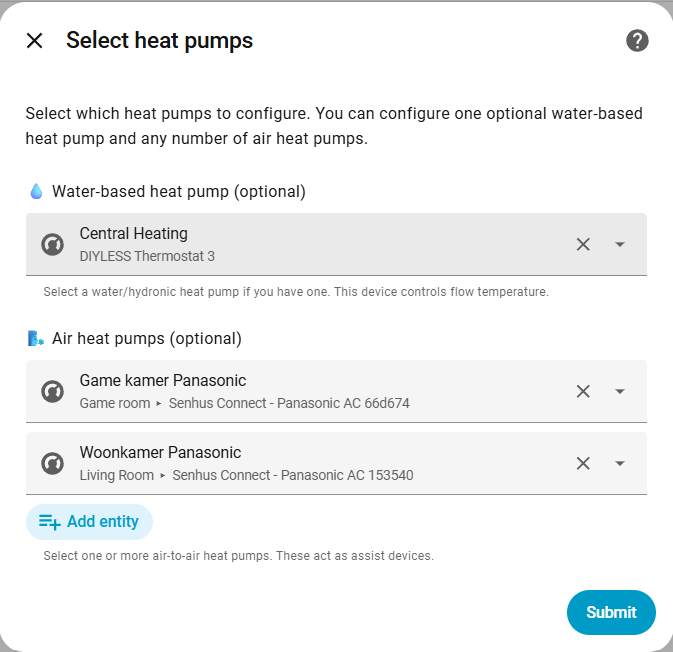

# PowerClimate

**Install via HACS (recommended):** Add this repository to HACS → Integrations → Custom repositories, set **Category** to **Integration**, then install and restart Home Assistant.

## Audit Log

- 0.2 — First public version
- 0.3-beta — Improved config flow and optional water heat pump
- 0.4.0-beta — Modularized core logic, assist control, solar power budgets, and formatting utilities
- 0.5-beta — Separated mirror thermostats

Home Assistant custom integration to manage multiple heat-pump climate devices
and coordinate their setpoints using per-device temperature offsets.
and coordinate their setpoints using per-device temperature offsets.

Not affiliated with Home Assistant.

## Features

- **Multi-heatpump orchestration**: One virtual thermostat coordinates one optional water-based heat pump and any number of air-based assist heat pumps.

- **Per-device offsets + guardrails**: Lower/upper offsets per device, plus global min/max setpoint limits.
- **Manual assists (default) + optional auto on/off**: You decide when assists run, or let PowerClimate manage assist HVAC mode with timers and anti-short-cycle.
- **Power-aware control (optional)**: `Solar` preset can allocate per-device power budgets from a signed house net power sensor.
- **Thermostat mirroring**: Optionally mirror setpoint changes from selected thermostats into PowerClimate.
- **Diagnostics**: Thermal summary, per-HP behavior, derivatives, total power, and budget diagnostics.
- **Works with standard HA services**: Orchestrates existing `climate.*` entities via Home Assistant.

## Documentation

- Detailed documentation (EN): [custom_components/powerclimate/README.md](custom_components/powerclimate/README.md)
- Gedetailleerde documentatie (NL): [custom_components/powerclimate/README-NL.md](custom_components/powerclimate/README-NL.md)

## Installation

### HACS (recommended)

1. In Home Assistant, open **HACS → Integrations → Custom repositories**.
2. Add the repository URL and set **Category** to **Integration**.
3. Search for **PowerClimate** and install it.
4. Restart Home Assistant.

### Manual

Copy `custom_components/powerclimate/` into your Home Assistant `config/custom_components/` and restart Home Assistant.

## Setup

1. Home Assistant → **Settings → Devices & Services → Add Integration → PowerClimate**.
2. Select one or more room temperature sensors (PowerClimate uses an average of available values).
3. Select thermostats that PowerClimate should mirror (optional). Setpoint changes on these thermostats will be copied to PowerClimate.
4. Select an optional water-based heat pump (0 or 1) and zero or more air-based assist heat pumps. The first mirrored thermostat is preselected for the water heat pump.

5. Configure each selected device on its own page (role, sensors, offsets, and optional on/off control for assists).

Note: Set the lower setpoint offset so that the heat pump almost, but not completely, switches off. In this example, the setpoint will be a minimum of 17 °C when the heat pump itself measures 20 °C.

## Support

- Issues and feature requests: use the GitHub issue tracker linked in the integration manifest.

## Control Algorithm

### Water-based heat pump (optional)
- If configured, PowerClimate can own the HVAC mode: the water-based device is forced to HEAT when the virtual
  climate entity is on and turned off otherwise.
- The PowerClimate target temperature is clamped between the lower/upper offsets (and the global 16–30 °C limits)
  before being sent to the water-based device.
- Water temperature is tracked and exposed via diagnostics (when a water sensor is configured).

### Air-based assist heat pumps (0..n)

- The user controls each assist pump's HVAC mode. When an assist is off,
  PowerClimate leaves it untouched.
- When an assist pump is on, PowerClimate compares the room temperature to
  the requested target:
  - **Minimal mode** (room ≥ target): setpoint = current temp + lower offset.
  - **Setpoint mode** (room < target): setpoint = requested target clamped
    between `current + lower offset` and `current + upper offset`.
- All temperatures are clamped between the global min/max before sending
  commands, ensuring thermostats stay in a safe operating window.

## Preset Behavior

PowerClimate presets control how heat pumps operate in different scenarios:

| Preset | 💧 Water Heat Pump | 🌬️ Air Heat Pump(s) |
|--------|-------------------|---------------------|
| **none** | Normal operation (HEAT mode, follows setpoint) | Setpoint-tracking if ON, untouched if OFF |
| **boost** | Boost mode (current + upper offset) | Boost mode (current + upper offset) |
| **Away** | Minimal mode (let temp drop to 16°C) | OFF (if allow_on_off enabled), otherwise minimal |
| **Solar** | Power-budgeted setpoint (uses surplus energy) | Power-budgeted setpoint (priority after water HP) |

**Note:** Solar preset requires a configured house net power sensor. Budgets are allocated in device order, prioritizing the water-based device when configured.
Away preset turns off air heat pumps only when `allow_on_off_control` is enabled for that device.

## Configuration Constants

All control parameters are defined in `const.py` and can be adjusted:

| Constant | Default | Description |
|----------|---------|-------------|
| `DEFAULT_MIN_SETPOINT` | 16.0 | Absolute minimum temperature that will ever be sent to a pump. |
| `DEFAULT_MAX_SETPOINT` | 30.0 | Absolute maximum temperature sent to any pump. |
| `DEFAULT_LOWER_SETPOINT_OFFSET_HP1` | -0.3 | HP1 minimal-mode offset relative to its own sensed temperature. |
| `DEFAULT_UPPER_SETPOINT_OFFSET_HP1` | 1.5 | HP1 ceiling offset relative to its sensed temperature. |
| `DEFAULT_LOWER_SETPOINT_OFFSET_ASSIST` | -4.0 | Assist minimal-mode offset (room satisfied). |
| `DEFAULT_UPPER_SETPOINT_OFFSET_ASSIST` | 4.0 | Assist ceiling offset when chasing the room setpoint. |

## Sensors

Sensors are added only for pumps that have a configured `climate_entity_id`.

| Sensor | Description |
|--------|-------------|
| Temperature Derivative | Room temperature change rate (°C/hour) |
| Water Derivative | Water temperature change rate (°C/hour) |
| Thermal Summary | Human-readable system state |
| HP1 Behavior | HVAC status, temps, water temperature when available |
| HP2 Behavior | HVAC status, temps, and PowerClimate mode (off/minimal/setpoint/power/boost) |
| HP3 Behavior | Same as above when a third pump is configured |
| HP4 Behavior | Same logic as HP2 when a fourth pump is configured |
| HP5 Behavior | Same logic as HP2 when a fifth pump is configured |
| Total Power | Aggregated power from all configured pumps |
| Power Budget | Allocated budget totals + per-device budgets (when enabled) |

Derivatives use the slope between the oldest and newest sample within the
window (room: 15 minutes, water: 10 minutes), matching Home Assistant's
Derivative helper behavior.

Behavior sensors label each pump as `<first word> (hpX)` to match the Thermal Summary format.

## Heat Pump Tips

General setup guidance (always double-check your device manual):

- Assist pumps (HP2–HP5): enable the manufacturer’s “heat shift” / °C offset if available to stabilize minimal mode, then tune `lower_setpoint_offset` accordingly so assists idle gently when the room is satisfied.
- Water/hybrid pump (HP1): if hybrid, disable gas for space heating and cap CH/flow temperature around 45°C initially for better COP; adjust based on insulation and emitters.

## Next Steps

- Use Advanced options to tune assist thresholds (ETA in minutes) and anti-short-cycle
- Use energy sensors or COP data for economic decisions
- Add unit tests for the assist logic
